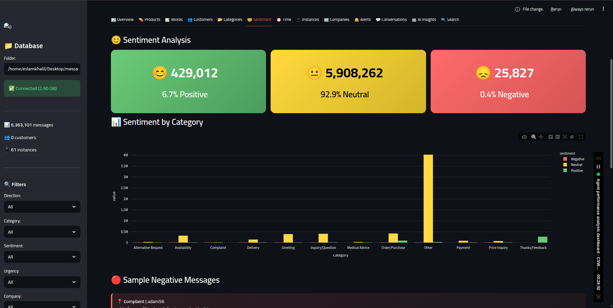
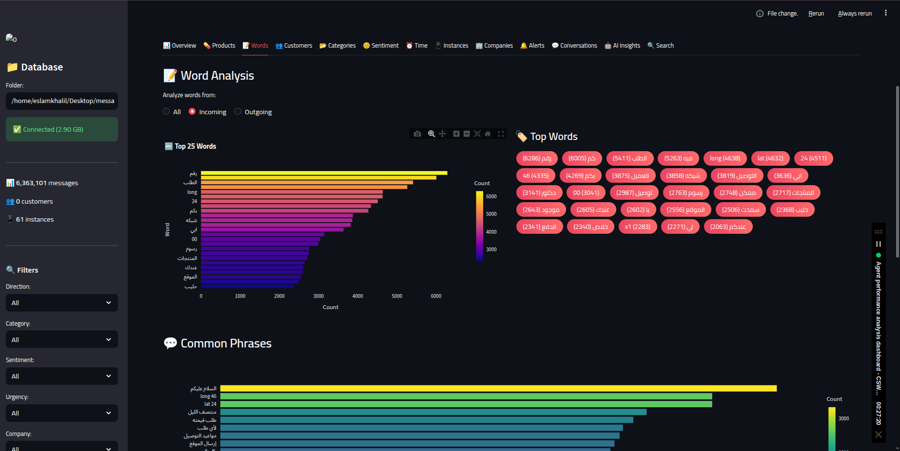

# 📊 Universal JSON Messaging Analytics Platform

**A powerful, memory-efficient analytics platform for processing large-scale JSON messaging data**

[English](#-overview) • [العربية](#-نظرة-عامة)

---

## 🎯 Overview

A complete data analytics solution designed to process **large JSON files (4GB+)** containing messaging data without memory overflow. The platform features streaming data processing, SQLite storage, interactive dashboards, and AI-powered insights.

### ✨ Key Features

- 🚀 **Streaming JSON Parser** - Process multi-GB files without memory issues
- 📊 **Interactive Dashboard** - 13+ analytics modules with real-time filtering
- 🧠 **NLP Analysis** - Sentiment analysis, auto-categorization, intent detection
- 👥 **Customer Intelligence** - Segmentation, VIP detection, behavior analysis
- 📈 **Time Analytics** - Peak hours, trends, heatmaps
- 🔍 **Full-Text Search** - Search across millions of messages instantly
- 📋 **Report Generation** - Export reports in HTML, CSV, JSON formats
- 🌐 **Bilingual Support** - English & Arabic interface

---

---

## 🖼️ Screenshots

| Dashboard Overview | Sentiment Analysis |
|:------------------:|:------------------:|
|  |  |

| Word Analysis | Customer Insights |
|:-------------:|:-----------------:|
|  |  |

---

## 🏗️ Architecture
